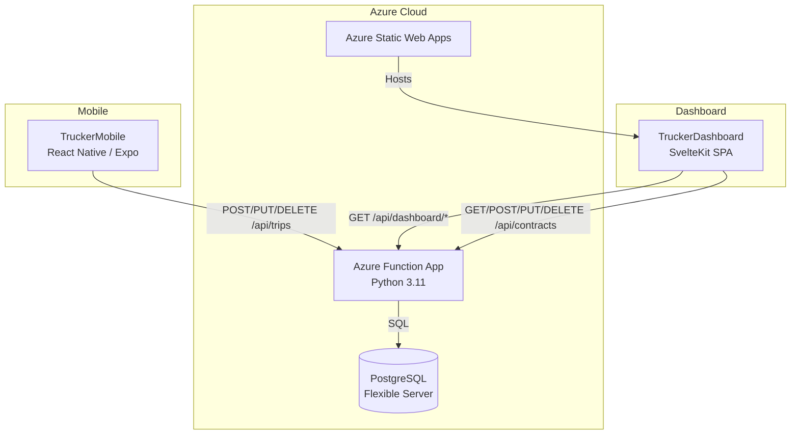
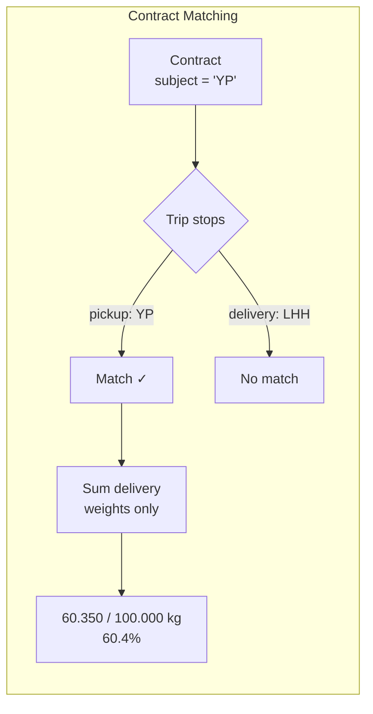

# Pathfinder Trucker Dashboard

Owner-facing SPA dashboard for tracking trucker trips, costs, weights, and shipment contracts. Built with **SvelteKit 2 + Svelte 5**, deployed as a static SPA on **Azure Static Web Apps**.

## System Overview



## Features

### Trip Management (Tổng quan tab)
- **Metric cards**: Total trips, advance payments, total costs
- **Interactive charts**: Cost breakdown by driver, weight by driver, cost categories, trips over time (Chart.js)
- **Detailed trip table**: Multi-stop expansion, per-stop weights, balance tracking, additional cost tags
- **Filters**: Driver, pickup location, delivery location, status (draft/completed), time range
- **Low-balance alerts**: Amber banner when any trucker's closing balance < 500,000 VND
- **Multi-format export**: CSV, Excel, PDF, JSON

### Shipment Contracts (Hợp đồng tab)
- **Contract CRUD**: Create, edit, delete shipment contracts with target tonnage, price/kg, and date range
- **Auto-matching**: Trips are matched to contracts by pickup OR delivery location matching the contract subject (đối tượng hợp đồng), within the contract date range
- **Progress tracking**: Real-time completion percentage with visual progress bars
- **Color-coded status**: Blue (on track), amber (≥80%), red (overdue), green (completed)
- **Contract alerts**: Banner notification when contracts reach ≥90% completion



### Authentication
- **Google OAuth**: Allowlisted email addresses only
- **Session-based**: Stored in sessionStorage, clears on tab close

## Architecture

```
src/
├── routes/+page.svelte         # Main page with tab navigation (Tổng quan / Hợp đồng)
├── lib/
│   ├── api/
│   │   ├── client.ts           # API client (dashboard + contract endpoints)
│   │   └── types.ts            # TypeScript interfaces (Trip, Contract, etc.)
│   ├── contracts/
│   │   └── ContractTab.svelte  # Contract management UI (cards, form, progress bars)
│   ├── charts/                 # Chart.js components (CostBreakdown, WeightChart, Timeline, CostCategories)
│   ├── exports/exporter.ts     # Multi-format export (CSV, Excel, PDF, JSON)
│   └── format.ts               # VND currency formatting, date helpers
├── app.css                     # Global design system (Inter font, CSS variables)
└── +layout.ts                  # prerender=true, ssr=false (static SPA)
```

### Key Design Decisions

| Decision | Rationale |
|----------|-----------|
| Single-page with tabs | Contracts and trips share context (same API base, same drivers). Tabs keep navigation simple. |
| Contract matching at query time | No FK links to trips — matching by location + date range is computed server-side via PostgreSQL lateral join. Simple, no sync issues. |
| Delivery weights only | Contract fulfillment counts only delivery stop weights, not pickup. Pickup weight ≠ delivered goods. |
| Extracted ContractTab component | Keeps +page.svelte manageable (~380 lines) by isolating the contracts UI (~210 lines) into its own component. |

## Development

```bash
npm install
npm run dev          # localhost:5173
npm run build        # Production build → /build
npm run check        # Type check + Svelte validation
```

## Deployment

```bash
./scripts/deploy.sh  # Build + deploy to Azure Static Web Apps
```

Requires Azure CLI login (`az login`). Deploys to: `https://thankful-water-0807a7b00.1.azurestaticapps.net`

## Related Repos

- **[TruckerMobileBackend](https://github.com/maiduydung/TruckerMobileBackend)** — Azure Function App API (trips, contracts, alerts)
- **[TruckerMobile](https://github.com/maiduydung/TruckerMobile)** — React Native/Expo mobile app for drivers
